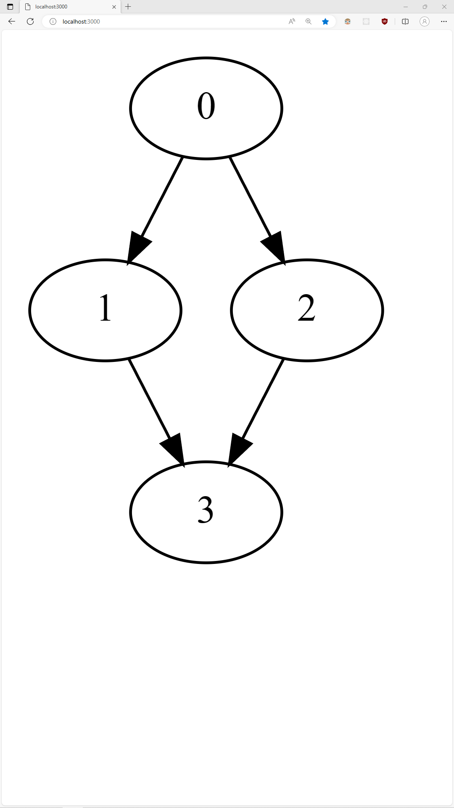

# Instructions

1. Make sure you have `npm` and the `dot` command installed on your system.
2. Run `npm install` in this repository.
3. Change the input graph in `index.ts`, then run `npm start` and view the contents of `index.html` in your browser.

# Demo

For the following input in `index.ts`,

```typescript
/**
 * The input graph should be
 * in a `[destination, source]` format.
 */
const inputGraph = [
  [1, 0],
  [2, 0],
  [3, 1],
  [3, 2]
] as const;
```

you should end up with something that looks like this.


